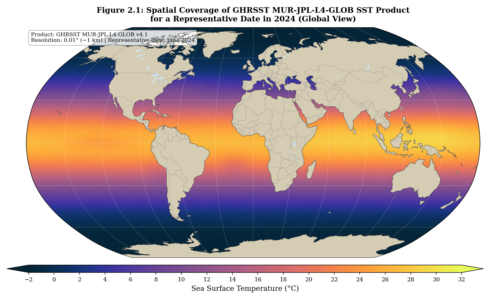
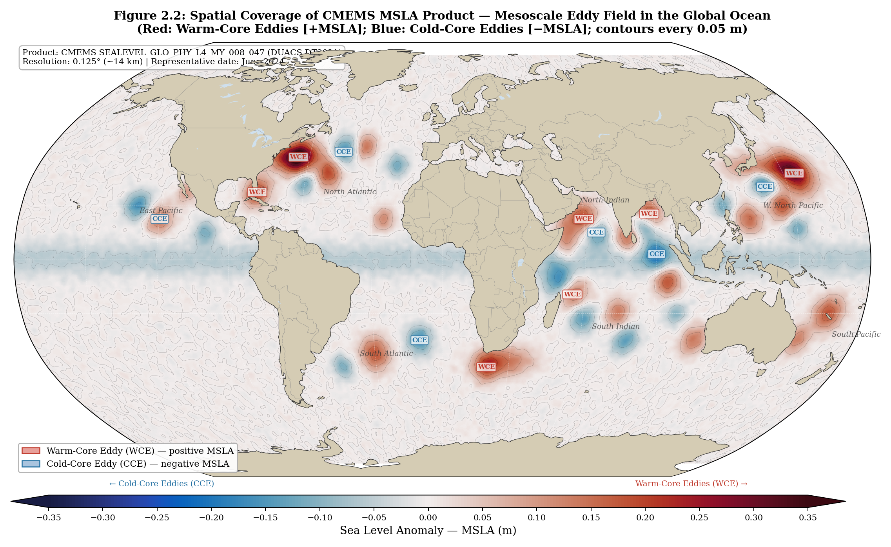
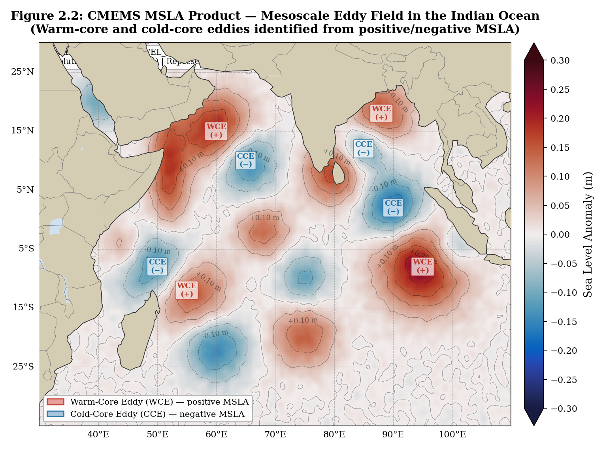
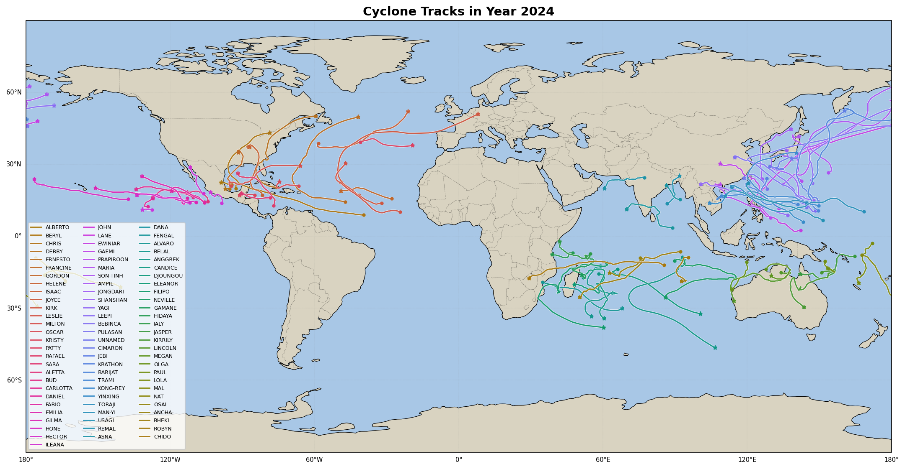
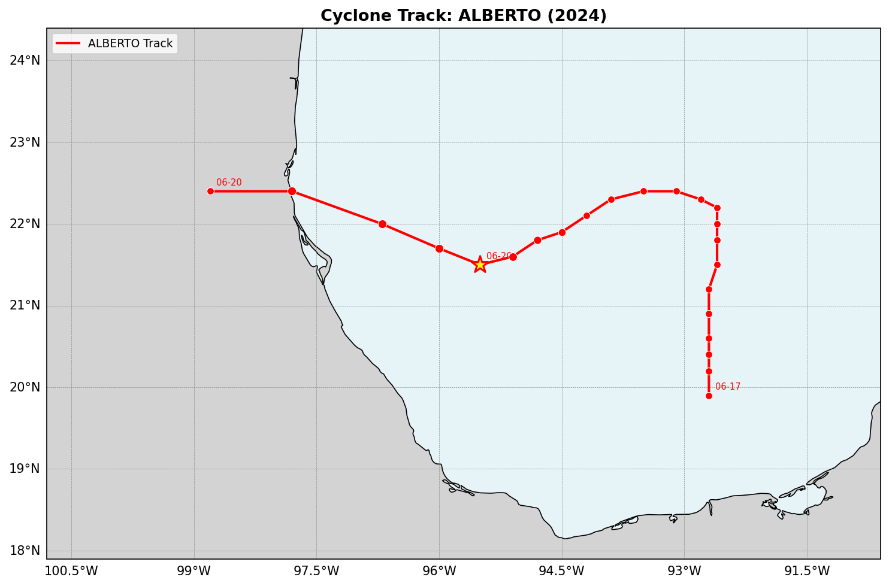
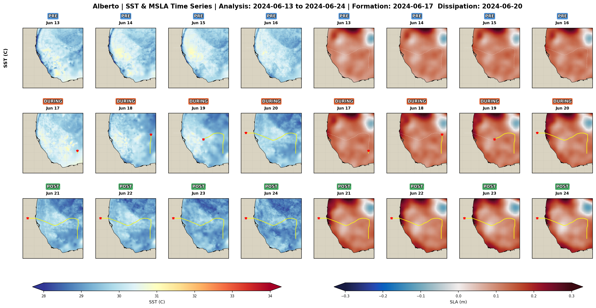
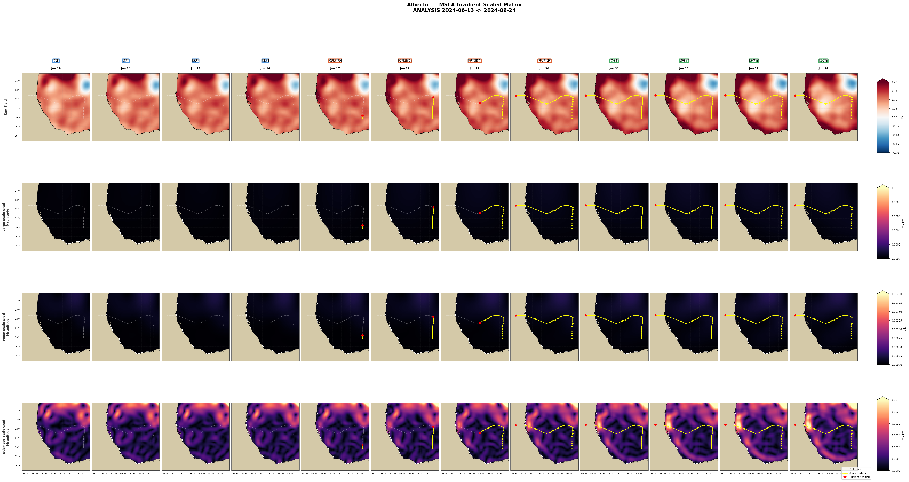

<h1 align="center">🌊 Cyclone Oceanic Response Analysis — 2024</h1>

<p align="center">
  <em>Gaussian scale decomposition of satellite SST &amp; sea level anomaly across the full lifecycle of tropical cyclones</em>
</p>

<p align="center">
  
  
  
  
</p>

---

This repository contains reproducible Jupyter notebooks for studying how the ocean responds to tropical cyclones, using two complementary satellite datasets:

- 🌡️ **GHRSST MUR SST** — Multi-scale Ultra-high Resolution sea surface temperature (0.01°, ~1 km daily)
- 🌊 **CMEMS DUACS MSLA** — Mesoscale sea level anomaly (0.125°, ~14 km daily)

The core analysis applies a **multi-scale Gaussian decomposition** to separate ocean signals into synoptic, mesoscale, and submesoscale components across the full lifecycle of each storm.

---

## 📁 Repository Structure

```
.
├── Cyclone_Scale_Decomposition_Analysis_for_multiple_cyclone.ipynb   ← Main analysis
├── ghrsst_mur_sst_analysis.ipynb                                      ← SST monthly/daily maps
├── CMEMS_MSLA_Visualization.ipynb                                     ← MSLA monthly/daily maps
├── cyclone_info_2024_padded.json                                      ← Cyclone database (78 storms)
├── requirements.txt
└── *.png                                                              ← Output figures (see below)
```

---

## 🛰️ Datasets

| Dataset | Product ID | Resolution | Period |
|:---|:---|:---:|:---:|
| **GHRSST MUR SST** | MUR-JPL-L4-GLOB-v4.1 | 0.01° · daily | 2024 · 367 files |
| **CMEMS MSLA (SLA)** | SEALEVEL_GLO_PHY_L4_MY_008_047 | 0.125° · daily | 2024 · 366 files |

> **Region of interest for climatology:** Bay of Bengal / Indian Ocean — `[80°–100°E, 5°–25°N]`
> The cyclone-centred analyses use a storm-following domain extracted globally.

---

## 📓 Notebooks

<details>
<summary><b>1. ghrsst_mur_sst_analysis.ipynb — GHRSST MUR SST Analysis</b></summary>

Produces **monthly mean SST maps** (3×4 panel per year) and **daily SST maps** for a configurable date window. All parameters live in a single **Configuration cell** (Section 2) — edit it, then hit *Restart & Run All*.

**Outputs**
| File | Description |
|---|---|
| `SST_Monthly_Mean_<YEAR>.png` | 3×4 panel of monthly mean SST |
| `SST_Daily_<YEAR>_<MM>_Day<start>-<end>.png` | Daily SST strip for chosen date range |

</details>

<details>
<summary><b>2. CMEMS_MSLA_Visualization.ipynb — CMEMS DUACS Sea Level Analysis</b></summary>

Produces **monthly mean SLA maps**, **monthly anomaly maps** (monthly − annual mean), and **daily SLA maps**.

**Outputs**
| File | Description |
|---|---|
| `SLA_Monthly_Mean_<YEAR>.png` | 3×4 panel of monthly mean SLA |
| `SLA_Monthly_Anomaly_<YEAR>.png` | 3×4 panel of anomaly vs annual mean |
| `SLA_Daily_<YEAR>_<MM>_Day<start>-<end>.png` | Daily SLA strip |

</details>

<details open>
<summary><b>3. Cyclone_Scale_Decomposition_Analysis_for_multiple_cyclone.ipynb — Main Analysis</b></summary>

The core notebook. For each cyclone in `cyclone_info_2024_padded.json` it:

1. Extracts the storm's analysis window — normalised to **12 or 20 days** with symmetric pre/post padding
2. Loads daily SST and MSLA fields centred on the storm track
3. Applies a **multi-scale Gaussian decomposition**:

| Row | Scale | Method |
|:---:|:---|:---|
| **1** | Raw field | Observed daily SST or MSLA (no filtering) |
| **2** | Large-scale | Broad Gaussian low-pass → synoptic background |
| **3** | Mesoscale | Band-pass (large − small Gaussian) → eddy-scale signal |
| **4** | Small-scale | Residual high-frequency → submesoscale / cold-wake |

4. Produces a **4-row × N-column evolution matrix** for both SST and MSLA, plus gradient-magnitude panels at each scale

</details>

---

## 🌀 Cyclone Database — 2024

`cyclone_info_2024_padded.json` catalogues **78 named storms** across 7 ocean basins for the 2024 season, with formation/dissipation dates and analysis-window padding.

| 🌐 Basin | # Storms | Notable Storms |
|:---|:---:|:---|
| 🟠 North Atlantic | 18 | Alberto · Beryl · Helene · Milton · Rafael |
| 🟣 West Pacific | 23 | Gaemi · Shanshan · Yagi · Trami · Man-Yi |
| 🔵 East Pacific | 12 | Carlotta · Gilma · Hone · John |
| 🟤 South Indian | 11 | Belal · Anggrek · Gamane · Hidaya |
| 🟢 Australia | 6 | Jasper · Kirrily · Lincoln · Megan |
| 🔴 North Indian | 4 | Remal · Asna · Dana · Fengal |
| 🟡 Southwest Pacific | 4 | Lola · Mal · Nat · Osai |

---

## 🗺️ Figures

### Dataset Coverage

**Figure 2.1 — GHRSST MUR SST: Global spatial coverage (2024)**

<p align="center">
  
</p>

> Global daily SST at 0.01° (~1 km) resolution from MUR-JPL-L4-GLOB v4.1. The field spans −2 °C (polar ice edge) to >32 °C (tropical warm pools), providing the thermal backdrop for all cyclone-centred analyses.

---

**Figure 2.2a — CMEMS MSLA: Mesoscale eddy field — Global Ocean**

<p align="center">
  
</p>

> Sea Level Anomaly from CMEMS DUACS at 0.125° resolution. 🔴 Red = warm-core eddies (+MSLA) · 🔵 Blue = cold-core eddies (−MSLA). Contours every 0.05 m. Major eddy corridors (Gulf Stream, Agulhas, Kuroshio, ACC) are clearly resolved.

---

**Figure 2.2b — CMEMS MSLA: Mesoscale eddy field — Indian Ocean**

<p align="center">
  
</p>

> Zoomed view of the Indian Ocean (40°–100°E, 25°S–25°N). Warm-core (WCE) and cold-core (CCE) eddies are individually labelled. This region hosts several 2024 cyclones (Remal, Anggrek, Hidaya) and shows strong eddy–cyclone interaction potential.

---

### 🌀 Cyclone Track Maps

**All 78 cyclone tracks — 2024 season**

<p align="center">
  
</p>

> Tracks for all 78 storms coloured by basin. The North Atlantic, West Pacific, and South Indian basin clusters are clearly distinct. Generated directly from `cyclone_info_2024_padded.json`.

---

**Cyclone Alberto (2024) — track detail**

<p align="center">
  
</p>

> Alberto formed on **2024-06-17** in the Gulf of Mexico, reached peak intensity near 21.5°N · 95.5°W (⭐), and dissipated on **2024-06-20** after landfall on the northeast Mexican coast. The analysis window spans **2024-06-13 → 2024-06-24** (12-day padded window).

---

**Alberto — Combined SST & MSLA Time Series Panel**

<p align="center">
  
</p>

> Side-by-side daily maps of raw **SST** (left) and raw **MSLA** (right) for the full analysis window 2024-06-13 to 2024-06-24. The cyclone centre (red dot), formation date, and dissipation date are annotated on each panel. This figure directly illustrates the co-evolution of the thermal and dynamic ocean signals through the storm's lifecycle.

---

### 🔬 Scale Decomposition — Cyclone Alberto

> All panels below show the **4-row × 12-column evolution matrix** across the analysis window.
> Each column = one day. Coloured column headers mark formation and dissipation dates.

---

**Alberto — SST Scale Decomposition**

<p align="center">
  
</p>

| Row | Scale | What you see |
|:---:|:---|:---|
| **1** | Raw SST | Warm Gulf of Mexico background; coastal cooling near the Yucatán Peninsula |
| **2** | Large-scale | Synoptic thermal gradient — smooth basin-wide SST signature |
| **3** | Mesoscale | Eddy-scale warm/cool anomalies modulating the pre-storm heat content |
| **4** | Small-scale | Localised cold-wake signal and coastal upwelling forced directly by Alberto |

---

**Alberto — MSLA Scale Decomposition**

<p align="center">
  
</p>

> Same 4-row layout for **sea level anomaly**. Row 2 (large-scale) shows the broad positive MSLA dome Alberto traversed — a warm-core eddy environment that likely contributed to rapid intensification. Rows 3–4 reveal how the mesoscale and submesoscale eddy field evolved around the track during and after landfall.

---

**Alberto — SST Gradient Magnitude**

<p align="center">
  
</p>

> Gradient magnitude at each SST scale. Row 1 captures sharp SST fronts; Rows 2–3 show how large/mesoscale frontal boundaries shift during the storm's passage; Row 4 highlights fine-scale turbulence generated in the cold wake.

---

**Alberto — MSLA Gradient Magnitude**

<p align="center">
  
</p>

> Gradient magnitude at each MSLA scale. The near-zero gradient in Row 2 (large-scale) transitions to clearly defined eddy-edge fronts in Rows 3–4, with enhanced submesoscale activity in the period immediately after dissipation.

---

## 🚀 Quick Start

### 1 · Install dependencies

```bash
pip install -r requirements.txt
```

### 2 · Run the SST notebook

```
ghrsst_mur_sst_analysis.ipynb
```
Edit **Section 2 — Configuration**: set `DATA_DIR`, `OUTPUT_DIR`, `YEARS`, `REGION`  
Then → **Restart & Run All**

### 3 · Run the MSLA notebook

```
CMEMS_MSLA_Visualization.ipynb
```
Edit **Section 2 — Configuration**: set `DATA_DIR`, `OUTPUT_DIR`, `YEARS`, `VAR_NAME`, `REGION`  
Then → **Restart & Run All**

### 4 · Run the cyclone scale decomposition

```
Cyclone_Scale_Decomposition_Analysis_for_multiple_cyclone.ipynb
```
Edit the **CONFIGURATION** block at the top: set `MSLA_ROOT_DIR`, `SST_ROOT_DIR`, `CYCLONE_JSON_PATH`  
Optionally filter by storm name or basin → **Run All** · one figure set is saved per cyclone

---

## 🗂️ Common Region Presets

```python
REGION = [80, 100,  5,  25]   # Bay of Bengal
REGION = [55,  78,  5,  25]   # Arabian Sea
REGION = [40, 100, -10, 30]   # Indian Ocean (broad)
REGION = None                  # Global
```

---

## 📦 Requirements

See [requirements.txt](requirements.txt) for pinned versions.

| Category | Packages |
|:---|:---|
| Data / science | `numpy` · `pandas` · `scipy` · `xarray` |
| Visualisation | `matplotlib` · `cartopy` · `cmocean` |
| Utilities | `python-pptx` · `nbformat` · `PyPDF2` |