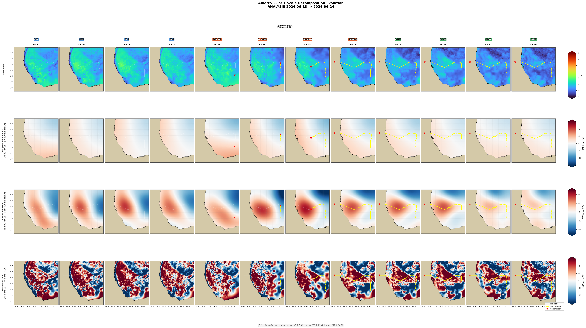
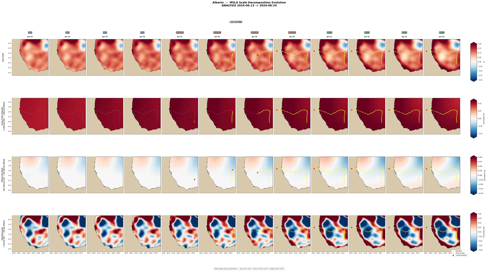
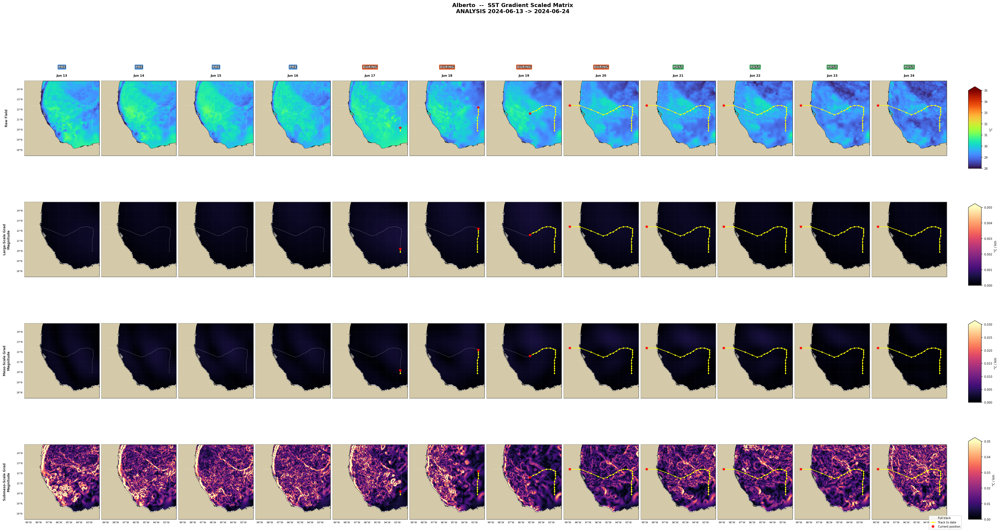

# Cyclone Oceanic Response Analysis — 2024

This repository contains reproducible Jupyter notebooks for studying how the ocean responds to tropical cyclones, using two complementary satellite datasets: **GHRSST MUR SST** (sea surface temperature) and **CMEMS DUACS MSLA** (mesoscale sea level anomaly). The core analysis applies a Gaussian scale-decomposition technique to separate ocean signals into large-scale, mesoscale, and small-scale components across the full lifecycle of each storm.

---

## Repository Structure

```
.
├── Cyclone_Scale_Decomposition_Analysis_for_multiple_cyclone.ipynb   # Main analysis
├── ghrsst_mur_sst_analysis.ipynb                                      # SST monthly/daily maps
├── CMEMS_MSLA_Visualization.ipynb                                     # MSLA monthly/daily maps
├── cyclone_info_2024_padded.json                                      # Cyclone database (2024, 78 storms)
├── requirements.txt
└── figures/  (PNG outputs committed to the repo — see below)
```

---

## Datasets

| Dataset | Product | Resolution | Coverage |
|---|---|---|---|
| **GHRSST MUR SST** | MUR-JPL-L4-GLOB-v4.1 | 0.01° (~1 km), daily | Global, 2024 (367 files) |
| **CMEMS MSLA** | SEALEVEL_GLO_PHY_L4_MY_008_047 | 0.125° (~14 km), daily | Global, 2024 (366 files) |

Both datasets were analysed over the Bay of Bengal / Indian Ocean subregion **[80°–100°E, 5°–25°N]** for monthly climatology, and globally for the cyclone-centred scale decomposition.

---

## Notebooks

### 1. `ghrsst_mur_sst_analysis.ipynb` — GHRSST MUR SST Analysis

Produces monthly mean SST maps (3×4 panel per year) and daily SST maps for a configurable date window. All parameters (paths, region, colormap, downsampling stride) live in a single **Configuration cell** at the top.

**Key outputs:**
- `SST_Monthly_Mean_<YEAR>.png`
- `SST_Daily_<YEAR>_<MM>_Day<start>-<end>.png`

---

### 2. `CMEMS_MSLA_Visualization.ipynb` — CMEMS DUACS Sea Level Analysis

Produces monthly mean SLA maps, monthly anomaly maps (monthly mean − annual mean), and daily SLA maps, all for the configured region and year list.

**Key outputs:**
- `SLA_Monthly_Mean_<YEAR>.png`
- `SLA_Monthly_Anomaly_<YEAR>.png`
- `SLA_Daily_<YEAR>_<MM>_Day<start>-<end>.png`

---

### 3. `Cyclone_Scale_Decomposition_Analysis_for_multiple_cyclone.ipynb` — Main Analysis

The core notebook. For each cyclone in `cyclone_info_2024_padded.json` it:

1. Extracts the storm's analysis window (normalised to 12 or 20 days with symmetric pre/post padding)
2. Loads daily SST and MSLA fields centred on the storm track
3. Applies a **multi-scale Gaussian decomposition** to separate the field into:
   - **Row 1 — Raw field** (observed SST or MSLA)
   - **Row 2 — Large-scale** (low-pass Gaussian filter, synoptic-scale background)
   - **Row 3 — Mesoscale** (band-pass: large-scale minus small-scale Gaussian)
   - **Row 4 — Small-scale / submesoscale** (residual high-frequency signal)
4. Produces a 4-row × N-column evolution matrix for both SST and MSLA, plus gradient-magnitude panels for each scale

---

## Cyclone Database — 2024

`cyclone_info_2024_padded.json` catalogues **78 named storms** across 7 ocean basins for the 2024 season, with formation/dissipation dates and analysis-window padding applied.

| Basin | Storms | Example |
|---|---|---|
| North Atlantic | 18 | Alberto, Beryl, Helene, Milton, Rafael |
| West Pacific | 23 | Gaemi, Shanshan, Yagi, Trami, Man-Yi |
| East Pacific | 12 | Carlotta, Gilma, Hone, John |
| South Indian | 11 | Belal, Anggrek, Gamane, Hidaya |
| Australia | 6 | Jasper, Kirrily, Lincoln, Megan |
| North Indian | 4 | Remal, Asna, Dana, Fengal |
| Southwest Pacific | 4 | Lola, Mal, Nat, Osai |

---

## Figures

### Dataset Coverage

**Figure 2.1 — GHRSST MUR SST global spatial coverage (2024)**


Global daily SST at 0.01° (~1 km) resolution from the MUR-JPL-L4-GLOB v4.1 product. The field spans −2 °C (polar ice edge) to >32 °C (tropical warm pools), providing the thermal backdrop for all cyclone-centred analyses.

---

**Figure 2.2a — CMEMS MSLA: Mesoscale eddy field, Global Ocean**


Sea Level Anomaly from CMEMS DUACS at 0.125° resolution. Red blobs = warm-core eddies (+MSLA); blue blobs = cold-core eddies (−MSLA). Contours every 0.05 m. Major eddy corridors (Gulf Stream, Agulhas, Kuroshio, ACC) are clearly resolved.

---

**Figure 2.2b — CMEMS MSLA: Mesoscale eddy field, Indian Ocean**


Zoomed view of the Indian Ocean (40°–100°E, 25°S–25°N). Multiple warm-core (WCE, +MSLA) and cold-core (CCE, −MSLA) eddies are labelled. This region hosts several of the 2024 cyclones (Remal, Anggrek, Hidaya, etc.) and shows strong eddy-cyclone interaction potential.

---

### Cyclone Track Maps

**All 2024 cyclone tracks — global**


Tracks for all 78 storms in the 2024 database coloured by basin. The North Atlantic, West Pacific, and South Indian basin clusters are clearly distinct. This map is generated directly from `cyclone_info_2024_padded.json`.

---

**Cyclone Alberto (2024) — track detail**


Alberto formed on 2024-06-17 in the Gulf of Mexico, reached peak intensity near 21.5°N 95.5°W (⭐), and dissipated on 2024-06-20 after making landfall on the northeast Mexican coast. The analysis window runs 2024-06-13 to 2024-06-24 (12-day padded window).

---

### Scale Decomposition — Cyclone Alberto

All panels below show the **4-row × 12-column evolution matrix** across the analysis window. Each column is one day; the cyclone formation and dissipation dates are marked with coloured headers.

---

**Alberto — SST Scale Decomposition**



| Row | Scale | Description |
|---|---|---|
| 1 | Raw SST | Observed daily SST (°C); shows the warm Gulf of Mexico background and coastal cooling |
| 2 | Large-scale | Synoptic SST background (broad Gaussian low-pass); captures basin-wide thermal gradient |
| 3 | Mesoscale | Band-pass signal; warm/cool mesoscale anomalies (eddies, filaments) modulating the cyclone environment |
| 4 | Small-scale | High-frequency residual; localised cold-wake signal and coastal upwelling directly forced by Alberto |

---

**Alberto — MSLA Scale Decomposition**



Same 4-row layout for **sea level anomaly**. The large-scale row (Row 2) shows the broad positive MSLA dome that Alberto traversed (warm-core eddy environment). Rows 3–4 reveal how the mesoscale and submesoscale eddy field evolved around the storm track during and after landfall.

---

**Alberto — SST Gradient Magnitude**



Gradient magnitude of each SST scale component. Row 1 captures sharp SST fronts; Rows 2–3 show how large/mesoscale frontal boundaries shift during the storm's passage; Row 4 highlights the fine-scale turbulence generated in the cold wake.

---

**Alberto — MSLA Gradient Magnitude**


Gradient magnitude of each MSLA scale component. The near-zero gradient in Row 2 (large-scale) transitions to clearly defined eddy-edge fronts in Rows 3–4, with enhanced submesoscale activity visible in the period immediately after the cyclone's dissipation.

---

**Alberto — Combined SST & MSLA Time Series Panel**


Side-by-side daily maps of raw SST (left column set) and raw MSLA (right column set) for the full analysis window 2024-06-13 to 2024-06-24. The cyclone centre (red dot), formation date, and dissipation date are annotated on each panel. This figure directly illustrates the co-evolution of the thermal and dynamic ocean signals through the storm's lifecycle.

---

## Quick Start

### Install dependencies

```bash
pip install -r requirements.txt
```

### Run the SST notebook

1. Open `ghrsst_mur_sst_analysis.ipynb`
2. Edit **Section 2 — Configuration**: set `DATA_DIR`, `OUTPUT_DIR`, `YEARS`, and `REGION`
3. Run → **Restart & Run All**

### Run the MSLA notebook

1. Open `CMEMS_MSLA_Visualization.ipynb`
2. Edit **Section 2 — Configuration**: set `DATA_DIR`, `OUTPUT_DIR`, `YEARS`, `VAR_NAME`, and `REGION`
3. Run → **Restart & Run All**

### Run the cyclone scale decomposition

1. Open `Cyclone_Scale_Decomposition_Analysis_for_multiple_cyclone.ipynb`
2. Edit the **CONFIGURATION** block at the top: set `MSLA_ROOT_DIR`, `SST_ROOT_DIR`, `CYCLONE_JSON_PATH`, and optionally filter by storm name/basin
3. Run all cells — one figure set is saved per cyclone

---

## Common Region Presets

```python
REGION = [80, 100,  5, 25]   # Bay of Bengal
REGION = [55,  78,  5, 25]   # Arabian Sea
REGION = [40, 100, -10, 30]  # Indian Ocean (broad)
REGION = None                  # Global
```

---

## Requirements

See [requirements.txt](requirements.txt). Core packages:

- `numpy`, `pandas`, `scipy`, `xarray` — data processing
- `matplotlib`, `cartopy`, `cmocean` — geospatial visualisation
- `python-pptx`, `nbformat`, `PyPDF2` — notebook/presentation utilities